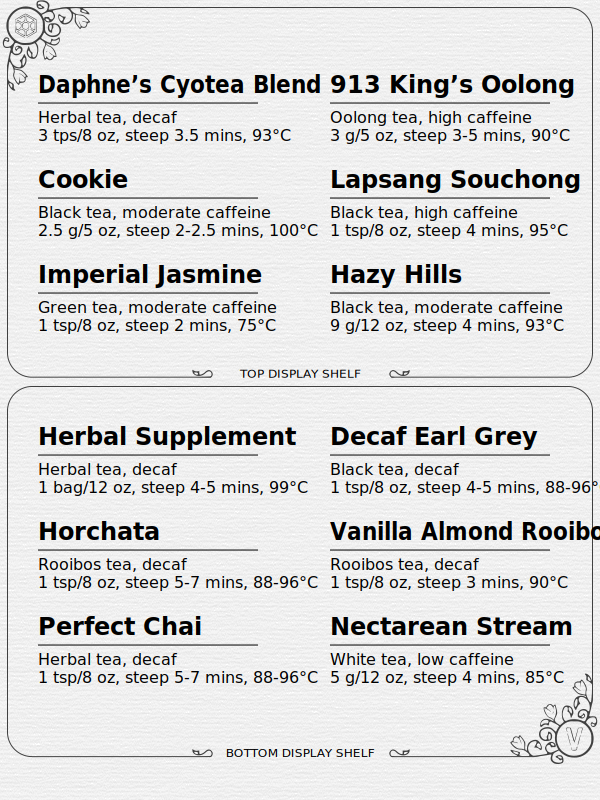

# tea-Book: e-ink tea list

At home, I have a display with small jars of loose tea leaves. I wanted to have
some way to quickly reference what was poured out, so I created this script to
pull a
[list of teas from Notion](https://tigeroakes.notion.site/1043e8edb9094976af12a59f25e41286?v=2f64f0297c1649458f5958ec4e68cd03).
It generates files for an e-reader to display, which allows me to have an easy
to update handheld menu to show guests when they visit.



## Generate summary image

The summary image shows the 12 teas on the display (6 for the top shelf, 6 for
the bottom shelf). Deno is used to generate an SVG file named `tea.svg`, which
can then be converted to a PNG file named `tea.png` using
[Inkscape](https://inkscape.org/). You can either open Inkscape's UI and export
the SVG manually, or use its CLI to export the SVG with one command.

```powershell
deno run --allow-net=api.notion.com --allow-env=NOTION_TOKEN,NOTION_DB --allow-read --allow-write .\src\generate.ts
inkscape --export-type="png" tea.svg
```

This image is used as an e-book cover. It can also be uploaded separately as a
screensaver for the e-reader. For the Nook Simple Touch, I placed file in the
following folder on the e-reader hard drive (`E:`):

```
E:\screensavers\Tea\tea.png
```

## Generate details ebook

Descriptions of each tea are written to an e-book. The e-book includes a table
of contents page formatted as a table with summarized tea information, followed
by a chapter for each tea. Deno generates a Markdown file named `tea-list.txt`
which is then converted by [Pandoc](https://pandoc.org/) into an ePub file named
`tea.epub`. ePubs are just zip files with a bunch of HTML, so you can validate
the content by making a copy with a `.zip` suffix instead of a `.epub` suffix.

```powershell
deno run --allow-net=api.notion.com --allow-env=NOTION_TOKEN,NOTION_DB --allow-read --allow-write .\src\generate.ts
pandoc tea-list.txt -o tea.epub --epub-title-page=false
cp tea.epub tea.zip
```

Validate result with https://epub-reader.online
